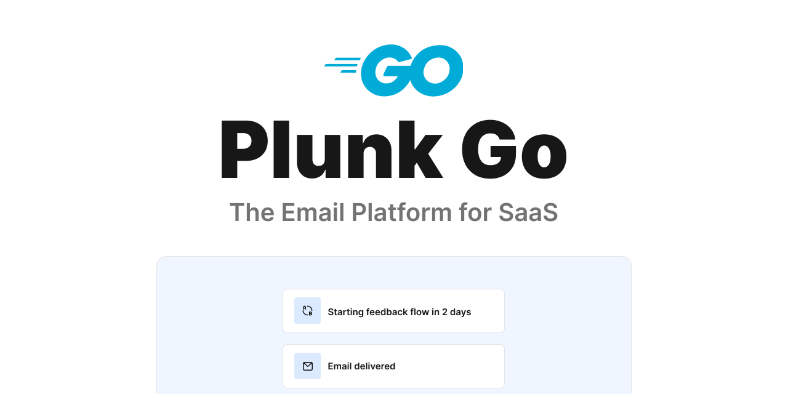

# Plunk with Go

[](https://godoc.org/github.com/kayode0x/plunk)
[](https://goreportcard.com/report/github.com/kayode0x/plunk)
[](https://coveralls.io/github/kayode0x/plunk?branch=main)
[](https://raw.githubusercontent.com/kayode0x/plunk/main/LICENSE)

Go library for interacting with the [Plunk](https://useplunk.com) [API](https://docs.useplunk.com).

<!-- Header image -->
<p align="center">
  <a href="https://useplunk.com">
    
  </a>
</p>

<!-- FEATURES -->
## Features
The Plunk Go SDK includes the following features:

Transactional Emails: Use the SendTransactionalEmail method to send one or more emails to your subscribers.

Events: Trigger events and creates it if it doesn't exist. You can also delete events.

Contacts: Create, update, and delete contacts. You can also get a list of contacts, as well as the number of contacts in your account.

Easy integration: The Plunk Go SDK is easy to integrate into your Go applications, with a simple and intuitive API.

<!-- GETTING STARTED -->
## Getting started

To get started with the Plunk Go SDK, simply install it using the go get command:

``` go get github.com/kayode0x/plunk ```

Then, create a new Plunk object with your Plunk API key and start using the SDK to send and track emails.

Example
Here's an example of how to use the Plunk Go SDK to send a simple email:

```go
package main

import (
	"fmt"
	"github.com/kayode0x/plunk"
)

func main() {
	// create a new Plunk object with your API key
	p, _ := plunk.New("YOUR_API_KEY", nil)

    // optionally, you can set some configuration options.
    config := &plunk.Config{
        BaseUrl: "https://api.useplunk.com",
        Debug: true,
        Client: &http.Client{
            Timeout: 10 * time.Second,
        },
    }

    // create a new Plunk object with your API key and config
    p, err := plunk.New("YOUR_API_KEY", config)
    if err != nil {
        fmt.Printf("Error creating Plunk object: %v", err)
        return
    }

	// create a new email payload
	payload := TransactionalEmailPayload{
		To:      "test@example.com",
		Subject: "Test Subject",
		Body:    "Test Body",
	}

	// send the email
	response, err := plunk.SendTransactionalEmail(payload)
	if err != nil {
		fmt.Printf("Error sending email: %v", err)
		return
	}

	fmt.Printf("Email sent: %v", response)
}

```

<!-- ROADMAP -->
## Roadmap

- [x] Send transactional emails

- [x] Trigger events

- [x] CRUD contacts

- [x] Get contacts, and number of contacts.
        
- [ ] Your awesome feature 😉

See the [open issues](https://github.com/kayode0x/plunk/issues) for a full list of proposed features (and known issues).

<!-- CONTRIBUTING -->
## Contributing

Any contributions you make are **greatly appreciated**.

If you have a suggestion that would make this better, please fork the repo and create a pull request. You can also simply open an issue with the tag "enhancement".

Don't forget to give the project a star! Thanks again!

1. Fork the Project

2. Create your Feature Branch (`git checkout -b feature/AmazingFeature`)

3. Commit your Changes (`git commit -m 'Add some AmazingFeature'`)

4. Push to the Branch (`git push origin feature/AmazingFeature`)

5. Open a Pull Request

<!-- TESTING -->
## Testing
To run tests, you need a Plunk API key. You can get one by signing up for a free account at https://useplunk.com.

Add the environment variable PLUNK_SECRET_KEY in your .env file with your Plunk API key.

Then, run the tests using the following command:

``` go test -v ```

If you receive an error that says contact already exists, you can manually delete the contact from your Plunk account, and then run the tests again.

<!-- SUPPORT -->
## Support

Ping me here, or feel free to reach out on twitter [@kayode0x](https://twitter.com/kayode0x). For Plunk specific issues, please reach out to [Plunk](https://useplunk.com).

<!-- LICENSE -->
## License

Distributed under the MIT License. See `LICENSE.txt` for more information.

<p  align="right">(<a  href="#top">back to top</a>)</p>